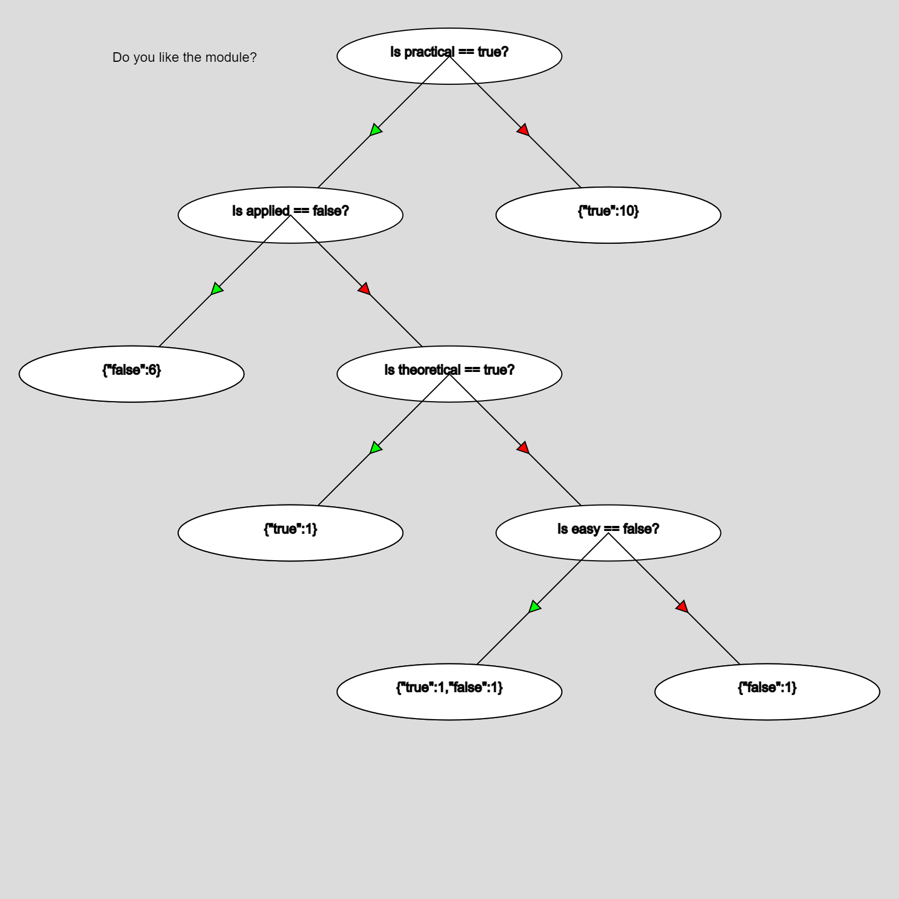

# Decision Tree

A JavaScript app to learn about how to build Decision Trees from a given data set.
To help with the visualization [p5.js](https://p5js.org/) is used.

## Example

The data is provided in a simple table where each row contains the answer to a simple true/false question.

| Like  | easy | applied | practical | theoretical | early |
| :---- | :--- | :------ | :-------- | :---------- | :---- |
| true  | true | true    | false     | true        | false |
| false | true | true    | false     | true        | false |
[...]

The code then finds the question which the highest information gain and build a tree from that.

The leaves are showing how many data points are reached by following the path to them.
